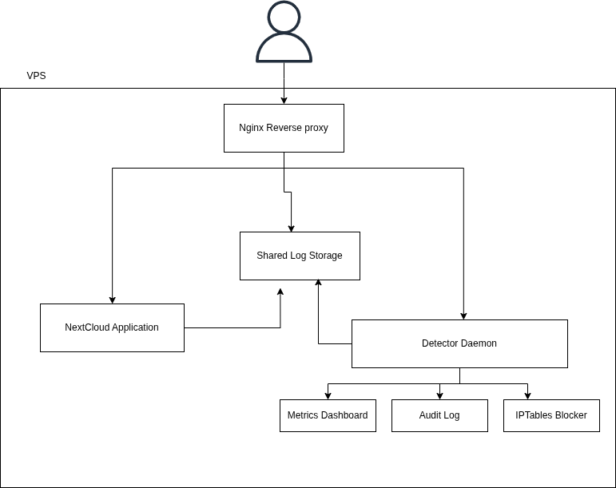

# HNG Stage 3 - Nextcloud Anomaly Detection Engine

This project implements a real-time anomaly detection and DDoS response layer for Nextcloud traffic.  
It tails Nginx JSON access logs, models normal traffic behavior with a rolling baseline, detects anomalies, blocks abusive IPs with iptables, sends Slack alerts, auto-unbans on backoff schedule, and serves a live metrics dashboard.

## Live Endpoints

- **Server IP (Nextcloud by IP):** `http://16.16.153.120`
- **Metrics Dashboard URL (domain/subdomain):** `http://detector.tutor-ai.im/`

> Replace placeholders before submission. Both endpoints should be live during grading.

## Links

- **Blog Post URL:** `https://dev.to/mart_young_ce778e4c31eb33/how-i-built-a-real-time-anomaly-detector-2cgp`

---

## Language Choice and Why

- **Language used:** `Python`
- **Why:** Python made log parsing, rolling-statistics calculations, and rapid daemon as well as dashboard iteration easier while keeping the logic readable and explainable from a not so technical perspective.

---

## Architecture



Traffic path:

`Internet -> Nginx (reverse proxy + JSON logs) -> Nextcloud`

Detection path:

`Nginx JSON access log -> Detector daemon -> (Anomaly evaluator -> iptables + Slack + Audit + Dashboard)`

### Components

- `nginx` (Docker): reverse proxy + JSON log producer
- `nextcloud` (given image): application workload
- detector daemon (host process / systemd): monitoring + detection + response
- `iptables`: per-IP blocking
- Slack webhook: notifications
- dashboard server: live metrics UI (`/`) and JSON metrics (`/metrics`)

---

## Repository Structure

```text
detector/
  main.py
  monitor.py
  baseline.py
  detector.py
  blocker.py
  unbanner.py
  notifier.py
  dashboard.py
  audit.py
  config.yaml
  requirements.txt
  detector.service
nginx/
  nginx.conf
docs/
  architecture.png
screenshots/
README.md
docker-compose.yml
```

---

## Setup Runbook (Fresh VPS to Running Stack)

### 1) Prerequisites

- Ubuntu VPS (minimum 2 vCPU, 2 GB RAM)
- DNS A record for dashboard subdomain -> server public IP
- Open inbound port `80` (and `443` later if enabling TLS)

### 2) Install Docker and Compose

```bash
sudo apt update
sudo apt install -y docker.io docker-compose-v2
sudo systemctl enable --now docker
sudo usermod -aG docker $USER
newgrp docker
docker --version
docker compose version
```

### 3) Clone and start application stack

```bash
git clone repo detection-engine
cd detection-engine
docker compose up -d
docker compose ps
```

### 4) Verify Nginx JSON logs

```bash
curl -I http://localhost/
docker exec -it hng-nginx sh -c 'tail -n 10 /var/log/nginx/hng-access.log'
docker volume ls | rg HNG-nginx-logs
```

Expected required fields in each JSON line:

- `source_ip`
- `timestamp`
- `method`
- `path`
- `status`
- `response_size`

### 5) Install detector dependencies

```bash
cd detection-engine/detector
python3 -m venv .venv
source .venv/bin/activate
pip install -r requirements.txt
```

### 6) Run detector via systemd (recommended)

```bash
sudo cp detection-engine/detector/detector.service /etc/systemd/system/detector.service
sudo systemctl daemon-reload
sudo systemctl enable --now detector
sudo systemctl status detector --no-pager
sudo journalctl -u detector -f
```

---

## Detection Logic

### Sliding Window (Deque)

- Window size: **60 seconds**
- Structures:
  - global request timestamp deque
  - per-IP request timestamp deques
  - per-IP error timestamp deques (`status >= 400`)
- Eviction logic: remove timestamps older than `now - 60s`

Implemented in:

- `detector/detector.py` (`SlidingWindowEngine`)

### Rolling Baseline

- Baseline window: **30 minutes (1800 per-second slots)**
- Recalculation interval: **60 seconds**
- Metrics:
  - `effective_mean`
  - `effective_stddev`
  - `error_mean`
- Hour-slot preference:
  - keeps per-hour slot grouping
  - prefers current hour when `min_current_hour_samples` is met
- Floor values:
  - `mean_floor`
  - `stddev_floor`
  - `error_floor`

Implemented in:

- `detector/baseline.py` (`RollingBaselineEngine`)

### Anomaly Criteria

Anomaly triggers when either condition is true:

- `z-score > 3.0`
- `current_rate > 5x baseline_mean`

Applied to:

- global traffic
- per-IP traffic

Error-surge tightening:

- if IP 4xx/5xx rate > `3x baseline error rate`, stricter thresholds are used for that IP.

Implemented in:

- `detector/detector.py` (`AnomalyEvaluator`)

---

## Response Logic

### Per-IP anomaly

- Add `iptables` DROP rule
- Send Slack ban alert (within detection path)
- Record audit log entry
- Register ban in backoff scheduler

### Global anomaly

- Send Slack alert only
- Record audit event
- No blanket blocking

### Auto-Unban Backoff

- 1st offense: 10 minutes
- 2nd offense: 30 minutes
- 3rd offense: 2 hours
- 4th+: permanent

Implemented in:

- `detector/blocker.py`
- `detector/notifier.py`
- `detector/unbanner.py`
- `detector/audit.py`

---

## Dashboard

Dashboard runs from detector process and refreshes every <=3 seconds.

- UI endpoint: `/`
- JSON endpoint: `/metrics`

Shows:

- banned IPs
- global req/s
- top 10 source IPs
- CPU usage
- memory usage
- effective mean/stddev
- uptime

Configuration in `detector/config.yaml`:

- `dashboard.enabled`
- `dashboard.host`
- `dashboard.port`
- `dashboard.refresh_seconds`

---

## Configuration Reference (`detector/config.yaml`)

Key sections:

- `logs`: access log path + parsing behavior
- `windows`: sliding-window length + print interval
- `baseline`: baseline window/recalc/floors
- `detection`: z-score/multiplier/tightening/cooldown
- `blocking`: protected CIDRs + ban durations
- `alerts`: Slack webhook and enable flag
- `audit`: audit log path
- `dashboard`: dashboard bind/port/refresh

All thresholds are externalized and tunable without code edits.

---

## Test Runbook

### Normal traffic sanity check

```bash
curl -I http://<SERVER_PUBLIC_IP>/
```

### Per-IP burst simulation

```bash
for i in $(seq 1 200); do curl -s -o /dev/null -I http://<SERVER_PUBLIC_IP>/; done
```

Expected:

- per-IP anomaly event
- ban action
- Slack ban alert
- audit BAN entry

### Error-surge simulation

```bash
for i in $(seq 1 200); do curl -s -o /dev/null -I http://<SERVER_PUBLIC_IP>/this-path-should-not-exist; done
```

Expected:

- elevated 4xx behavior
- potential tightened per-IP detection path

### Firewall evidence

```bash
sudo iptables -L -n | rg DROP
```

### Audit evidence

```bash
tail -n 30 /home/ubuntu/detection-engine/detector/audit.log
```

---


## Troubleshooting

### 502 on dashboard domain

Cause: Nginx container cannot reach host dashboard process.

Fix:

- `docker-compose.yml` add:
  - `extra_hosts: ["host.docker.internal:host-gateway"]`
- dashboard proxy target:
  - `proxy_pass http://host.docker.internal:8088;`

### Locked out by self-ban

If your own IP gets blocked:

```bash
sudo iptables -D INPUT -s <YOUR_IP> -j DROP
```

Prevent recurrence:

- add your admin/public IP to `blocking.protected_cidrs`

### systemd restart loop with address-in-use

Cause: manual detector process already running on same port.

```bash
sudo systemctl stop detector
sudo pkill -f "/home/ubuntu/detection-engine/detector/main.py"
sudo systemctl start detector
```
